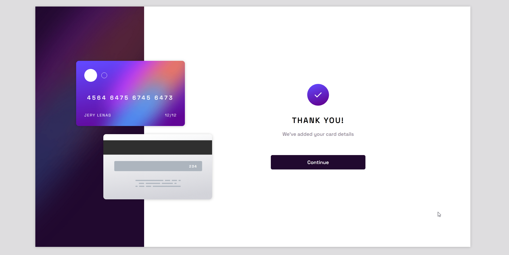

# Frontend Mentor - Interactive card details form solution

This is a solution to the [Interactive card details form challenge on Frontend Mentor](https://www.frontendmentor.io/challenges/interactive-card-details-form-XpS8cKZDWw). Frontend Mentor challenges help you improve your coding skills by building realistic projects.

## Table of contents

- [Overview](#overview)
  - [Screenshot](#screenshot)
  - [Links](#links)
- [My process](#my-process)
  - [Built with](#built-with)
  - [What I learned](#what-i-learned)
  - [Continued development](#continued-development)
  - [Useful resources](#useful-resources)
- [Author](#author)

**Note: Delete this note and update the table of contents based on what sections you keep.**

## Overview

### The challenge

Users should be able to:

- Fill in the form and see the card details update in real-time
- Receive error messages when the form is submitted if:
  - Any input field is empty
  - The card number, expiry date, or CVC fields are in the wrong format
- View the optimal layout depending on their device's screen size
- See hover, active, and focus states for interactive elements on the page

### Screenshot

    
    
    

    
    

### Links

- Source Code URL: [Source Github](https://github.com/lenez12/interactive-card-details-form-main.git)
- Live Site URL: [Demo Live](https://lenez-interactive-card.netlify.app/)

## My process

### Built with

- Semantic HTML5 markup
- CSS custom properties
- Flexbox
- CSS Grid
- JQuery
- JQuery Masking Input

### What I learned

what I learned in making this challenge is:

1. using css grid to create template area
2. using css grid and media query to create responsive mobile
3. manipulate DOM using javascript
4. how create a form-control from the stracth
5. create validation with javascript
6. adding transition on some component

### Continued development

1. In the future I will make a good css class naming name
2. add animation and transition when hover and activate

### Useful resources

- [W3Schools](https://www.w3schools.com/howto/howto_css_center-vertical.asp)
- [Reset CSS](https://piccalil.li/blog/a-modern-css-reset/)
- [Event in DOM](https://developer.mozilla.org/en-US/docs/Web/API/HTMLElement/change_event)
- [Pattern on input](https://www.aleksandrhovhannisyan.com/blog/html-input-validation-without-a-form/)
- [Validation Html DOM](https://dev.to/javascriptacademy/form-validation-using-javascript-34je)

## Author

- Frontend Mentor - [@Lenez](https://www.frontendmentor.io/profile/yourusername)
- Twitter - [@prak_tech](https://www.twitter.com/prak_tech)

